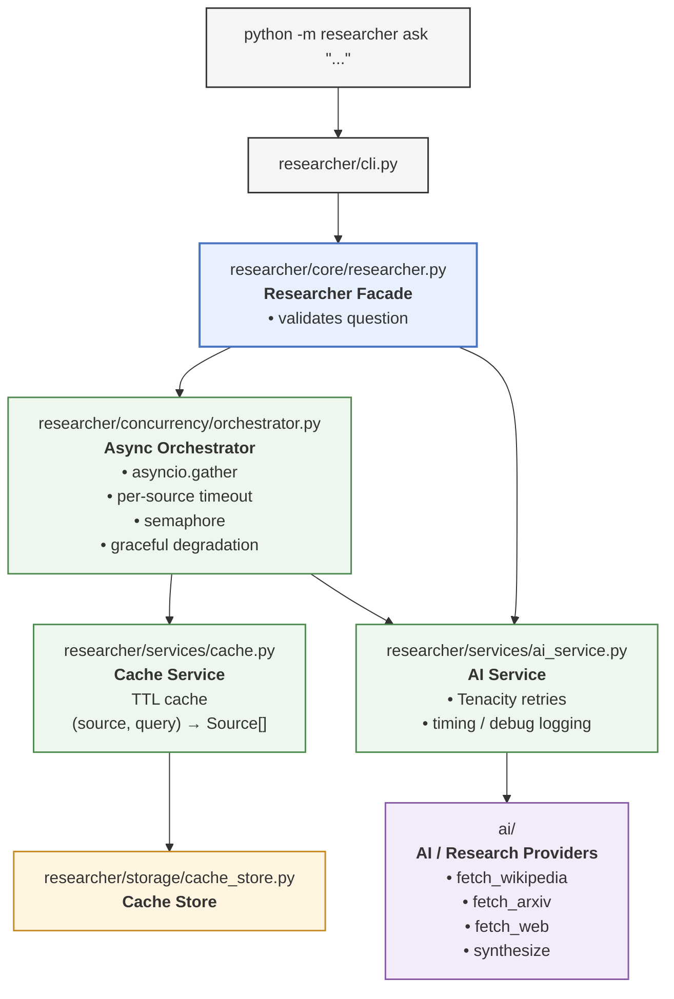

# Async Research Assistant

> Ask a research question; the system queries Wikipedia, arXiv, and a web-search API concurrently, then synthesizes one cited answer.

**Team:** M503-SWE-06 • **Topic:** 4 — Async Research Assistant • **Course:** AI-ENG-110 Software Engineering, AI Academy

**Members:** Sanan Garibli ([@sanan-garibli](https://github.com/sanan-garibli)) • Farah Nematzada ([@f4r4hh](https://github.com/f4r4hh)) • Hümbət Camalov ([@Camalzadeh](https://github.com/Camalzadeh))

---

## Quick start

```bash
# 1. Clone & install
git clone https://github.com/team-M503-SWE-06/research-assistant
cd research-assistant
python -m venv .venv
.venv\Scripts\activate          # Windows; use `source .venv/bin/activate` on macOS/Linux
pip install -r requirements.txt

# 2. Configure
copy .env.example .env          # `cp .env.example .env` on macOS/Linux, then fill in real API keys
# DO NOT commit .env — it is already in .gitignore

# 3. Run the tests
pytest tests/test_ai_smoke.py -v                          # provided, graded smoke tests
pytest --cov=researcher --cov-report=term-missing          # full suite with coverage

# 4. Run the demo (needs LLM + web-search API keys in .env)
python -m researcher demo
python -m researcher ask "What is CRISPR-Cas9 gene editing?"
```

Offline sanity checks that need no API keys at all:

```bash
python demo_ai.py --offline          # exercises the provided ai/ package with canned data
pytest tests/test_ai_smoke.py -v     # all 16 tests, no network
```

## Run with Docker

```bash
docker build -t research-assistant .

# Default command: runs all 5 sample questions end-to-end
docker run --env-file .env research-assistant

# Override the command to ask a single question (no ENTRYPOINT is set, so
# pass the full command, not just the subcommand):
docker run --env-file .env research-assistant python -m researcher ask "What is CRISPR?" --no-cache

# Run the graded smoke tests inside the container
docker run --env-file .env research-assistant pytest tests/test_ai_smoke.py -v
```

## Environment variables

| Variable | Required? | Default | What it controls |
|---|---|---|---|
| `LLM_PROVIDER` | no | `anthropic` | `anthropic` \| `openai` \| `gemini` |
| `LLM_MODEL` | no | provider default | model id passed to the provider |
| `ANTHROPIC_API_KEY` / `OPENAI_API_KEY` / `GOOGLE_API_KEY` | yes (one, matching `LLM_PROVIDER`) | — | key for the chosen LLM provider |
| `WEB_SEARCH_PROVIDER` | no | `tavily` | `tavily` \| `serper` \| `duckduckgo` |
| `TAVILY_API_KEY` / `SERPER_API_KEY` | yes (one, matching `WEB_SEARCH_PROVIDER`) | — | key for the chosen web-search provider (`duckduckgo` needs none) |
| `LOG_LEVEL` | no | `INFO` | `DEBUG` \| `INFO` \| `WARNING` \| `ERROR` \| `CRITICAL` |
| `CACHE_DIR` | no | `./.cache` | filesystem directory for the source cache |
| `CACHE_TTL_SECONDS` | no | `86400` | how long a cached `(source, query)` result stays valid |
| `PER_SOURCE_TIMEOUT_SECONDS` | no | `10` | per-source fetch timeout (covers all retries for that source) |
| `MAX_SOURCES_PER_QUERY` | no | `3` | results requested per source |
| `MAX_CONCURRENT_FETCHES` | no | `5` | semaphore bound on total in-flight external fetches |
| `MAX_QUESTION_LENGTH` | no | `500` | reject questions longer than this |
| `RETRY_MAX_ATTEMPTS` | no | `3` | attempts per `ai.*` call before giving up |
| `RETRY_BACKOFF_SECONDS` | no | `0.5` | base delay for exponential backoff between retries |

The full list with comments is in `.env.example`. **Never commit a real `.env`.**

## CLI usage

```bash
python -m researcher ask "How does CRISPR-Cas9 gene editing work?"
python -m researcher ask "What is fusion energy?" --no-cache
python -m researcher ask "What is photosynthesis?" --sources wiki,arxiv
python -m researcher demo --limit 3
```

Sample output:

```
Q: What is photosynthesis and what are its main stages?

A: Photosynthesis is the process by which plants convert light energy into
chemical energy [1]. The reaction takes place in the chloroplasts and
produces oxygen as a byproduct [2].

References:
  [1] (wikipedia) Photosynthesis
      https://en.wikipedia.org/wiki/Photosynthesis
  [2] (arxiv) Light-Dependent Reactions of Photosynthesis
      https://arxiv.org/abs/...

(timing: wikipedia=0.42s, arxiv=0.61s, web=0.38s; * = cache hit)
```

## Sequential vs concurrent benchmark

```bash
python scripts/bench.py --limit 5
```

| Workload | N | Sequential | Concurrent | Speedup |
|---|---|---|---|---|
| 5 sample research questions (run 2, all sources healthy) | 5 | 46.8s | 11.7s | 4.0x |
| 5 sample research questions (run 1, one arXiv 10 s timeout in the sequential phase) | 5 | 71.6s | 11.8s | 6.1x |

`scripts/bench.py` runs the same N questions once with a plain `for` loop and once via `asyncio.gather`, both with `--no-cache` semantics so the numbers reflect real fetch/synthesis concurrency, not cache hits. Measured 2026-09-12 against this codebase (the figures predate the move to this repository; the measured code is unchanged) on a Windows 11 laptop with Python 3.14.3, `LLM_MODEL=claude-opus-5` and Tavily web search. Synthesis is ~91% of the sequential time, so the concurrent run is bounded by the slowest single question (~1–2 s of fetches plus ~10 s of LLM), not by the semaphore. Running `python -m researcher demo` twice gave 0/15 source-cache hits on the first pass and 15/15 on the second.

**Expected bottleneck:** each `ask` call fans out 3 I/O-bound fetches (Wikipedia, arXiv, web search) concurrently via `asyncio.gather`, so a single call's wall time is bounded by the *slowest* of the three, not their sum — `researcher/concurrency/orchestrator.py` and `tests/test_orchestrator.py::test_sources_fetched_in_parallel_not_sequentially` demonstrate this at the unit level with staggered fake delays. Running multiple `ask` calls concurrently (as the benchmark does) additionally amortizes each call's fixed overhead (LLM synthesis latency, connection setup) across the batch; the `MAX_CONCURRENT_FETCHES` semaphore caps how much of that can happen in parallel before the LLM provider's own rate limits become the bottleneck.

## Testing

```bash
pytest --cov=researcher --cov-report=term-missing
```

- Total coverage on `researcher/`: **95%** (435 statements, 22 missed; ≥60% required, enforced in CI by `--cov-fail-under=60`)
- Provided `tests/test_ai_smoke.py`: **16/16 passing, unmodified**
- **90 tests total** (74 own + 16 provided), all offline — no test touches the live network. `ai.*` calls are mocked via `unittest.mock`/`monkeypatch`; HTTP-layer tests can additionally use `respx`.
- Concurrency is specifically exercised in `tests/test_orchestrator.py`: parallel fan-out timing, graceful degradation when one source raises, per-source timeout isolation, semaphore-bounded concurrency, and cache-hit short-circuiting.
- `ruff check .` and `mypy researcher/` both pass; configuration lives in `pyproject.toml`. Both tools exclude the provided `ai/`, `demo_ai.py` and `tests/test_ai_smoke.py`, which carry pre-existing findings in files the assignment's contract forbids us to modify.
- Every push and pull request runs lint, type check, tests with the coverage gate, and a Docker build via `.github/workflows/ci.yml`.

## Project layout

```
.
├── ai/                         # PROVIDED — do not modify
├── researcher/
│   ├── config.py                # typed settings (pydantic-settings)
│   ├── models.py                 # SourceOutcome, ResearchSession
│   ├── logging_config.py
│   ├── bootstrap.py              # composition root
│   ├── services/
│   │   ├── ai_service.py         # retry/timeout/logging wrapper around ai.*
│   │   └── cache.py              # TTL-aware (source, query) cache
│   ├── core/
│   │   ├── validation.py
│   │   ├── errors.py
│   │   └── researcher.py         # business logic facade
│   ├── concurrency/
│   │   └── orchestrator.py       # asyncio.gather, per-source timeouts, semaphore
│   ├── storage/
│   │   └── cache_store.py        # CacheBackend ABC + filesystem/in-memory impls
│   └── cli.py                    # `ask` / `demo` subcommands
├── scripts/
│   └── bench.py                  # sequential-vs-concurrent benchmark
├── tests/                        # provided smoke tests + our offline test suite
├── data/                          # sample research questions
├── .github/workflows/ci.yml      # lint, type check, tests + coverage gate, docker build
├── Dockerfile
├── .dockerignore
├── pyproject.toml                # ruff + mypy configuration
├── pytest.ini
├── requirements.txt
├── .env.example
└── README.md
```

## Architecture

The CLI hands a validated question to a facade, which delegates to an async orchestrator that fans out to Wikipedia, arXiv, and web search concurrently via `asyncio.gather`. A thin service layer wraps the provided `ai/` package with retries and timing, and a TTL cache sits in front of each source. Exactly one module crosses into `ai/`, and exactly one crosses the storage boundary.



**Boundaries.** Exactly one arrow crosses into the provided `ai/` package (`ai_service.py → ai/`), and exactly one crosses the storage boundary (`cache.py → cache_store.py`); the orchestrator never touches a file. `models.py` (`SourceOutcome`, `ResearchSession`) is the typed payload that travels along every arrow inside `researcher/` — no naked dictionaries cross a module boundary. Swapping the LLM provider changes zero files here: it is `LLM_PROVIDER=...` plus a key, dispatched inside the provided `ai.providers.factory`.

One shared `httpx.AsyncClient` is owned by the orchestrator for its whole lifetime and passed into every `ai.*` fetch, so connections are pooled across questions, not just within one. It is built at composition time over a process-wide SSL context — constructing the trust store costs ~0.35s, which would otherwise be charged to every `ask` call — and released by `Researcher.aclose()` (or `async with researcher:`, which the CLI and benchmark use). Each source's cache check happens before the semaphore is acquired, so cache hits never contend with live fetches for the concurrency budget.

## Limitations

- Only source lists are cached, not final synthesized answers — LLM output isn't deterministic per call, so answer-level caching was out of scope for this assignment's caching requirement.
- Cache expiry is lazy (checked on read); there is no background sweeper removing stale files from `CACHE_DIR`.
- No persistent database — the cache is filesystem JSON, which is sufficient at this scale but wouldn't scale to concurrent multi-process writers.
- Wikipedia's search API matches article titles by prefix, so a full question returns nothing; `AIService.fetch_wikipedia` retries with shorter keyword phrases (`researcher/services/search_terms.py`). The stopword list is tuned on the sample questions, so an unusual question may still get no Wikipedia sources or only a broad article.

## Tools & acknowledgements

Claude Code (Anthropic) was used by the team while building the `researcher/` SE layer, the
test suite, the Dockerfile and CI workflow, and this README, working from the
`TOPIC.md` / `SOFTWARE_PROJECT.tex` specification. Each member reviewed and can explain the
code landed under their name; the per-member breakdown is in the contribution statement
submitted with the final package, and the full disclosure is in `report/report.pdf`.

The `ai/` package, the sample data, and `tests/test_ai_smoke.py` were provided by the course
and are unmodified.

## License

Academic coursework for AI-ENG-110, not a published library.
